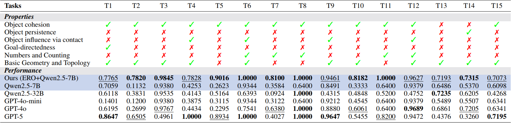

# Evolutionary Reasoning Optimization (ERO)
 
A step-by-step python implementation for our paper "Evolutionary System 2 Reasoning: An Empirical Proof".

```latex
@article{ERO,
  title={Evolutionary System 2 Reasoning: An Empirical Proof},
  author={Zeyuan Ma and Wenqi Huang and Guo-Huan Song and Hongshu Guo and Sijie Ma and Zhiguang Cao and Yue-Jiao Gong},
  journal={arXiv preprint arXiv:2512.05760},
  year={2025}
}
```




### Step 1

**Install dependencies**
```
pip install -r requirements.txt
```

### Step 2

**Check Hardware conditions**

To run ERO, we require the system equipped with:

* 64 GB RAM
* 4 * 64 GB GPUs (every GPU we use is a virtual node of H20)
* 150 GB disk capacity

When additional GPUs are used, the RAM and disk capacity should be increased accordingly.

### Step 3

**Download Model**

Download the model Qwen2.5-vl-7b-instruct from huggingface and place it in the folder "models/base_model".

Download: https://huggingface.co/Qwen/Qwen2.5-VL-7B-Instruct

### Step 4

**Download ARC Task Data (Optional)**

We have provided some of the ARC-1 tasks we used in our experiments. If you want to use other tasks, download and put them in the folder "data". Then, modify the variable "es_list" in "main.py" accordingly.

Download: ARC-1: https://github.com/fchollet/ARC-AGI

### Step 5

**Run**

Run ERO with default settings:
```
python main.py
```

You can also indicate evolution settings in ERO:
```
python main.py --size 1000 --epochs 12 --scale 0.15
```

See "main.py" for detailed configurable parameters in ERO. 

### Step 6

***Save data***

In the end of the ERO, the results will be saved in the folder "results" automatically and the best model will be saved in "models/best_models".

### Step 7

***Evaluate model***

A example can be:
```
python eval.py --state_dict models/best_models/9a4bb226_state_dict.pth --task 9a4bb226
```

The JSON file for the task will be searched and read from the folder "data". The output and the score will be printed on the console.
